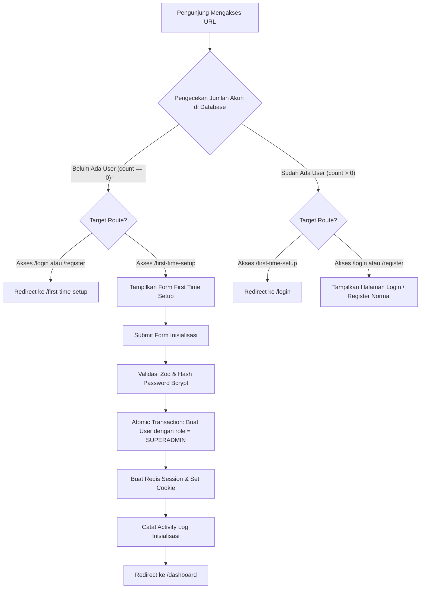

# First Time Setup Module

Dokumen ini menjadi spesifikasi teknis dan rencana implementasi untuk modul **First Time Setup (Inisialisasi Sistem & Akun SuperAdmin Pertama)** pada platform Benah Palembang. Modul ini bertindak sebagai gerbang *onboarding* awal ketika aplikasi baru pertama kali dijalankan dan database belum memiliki akun pengguna sama sekali.

Route canonical:
```text
/first-time-setup
```

Aturan otentikasi merujuk pada [`docs/module/auth.md`](file:///Users/lanstheprodigy/Data/project/benah-palembang/docs/module/auth.md) dan aturan arsitektur data merujuk pada [`docs/rules/project-structure.md`](file:///Users/lanstheprodigy/Data/project/benah-palembang/docs/rules/project-structure.md).

---

## 1. Scope & Tujuan Modul

1. **Inisialisasi Akun SuperAdmin Pertama:**
   - Menyediakan antarmuka pendaftaran khusus pada `/first-time-setup` yang secara otomatis menetapkan peran **`SUPERADMIN`** pada akun pertama yang didaftarkan.
2. **Proteksi & Pengalihan Otomatis (*Bi-directional Redirection*):**
   - **Kondisi 1: Database Kosong (Belum Ada Akun Pengguna):**
     - Setiap pengunjung yang membuka `/login` atau `/register` secara otomatis dialihkan (*redirect*) ke `/first-time-setup`.
     - Halaman `/first-time-setup` dapat diakses dan menampilkan formulir pendaftaran inisialisasi sistem.
   - **Kondisi 2: Database Sudah Terisi (Akun Pengguna Sudah Ada):**
     - Halaman `/first-time-setup` **dikunci secara permanen** dan tidak dapat diakses lagi.
     - Setiap percobaan membuka `/first-time-setup` secara otomatis dialihkan ke `/login` (atau ke `/dashboard` jika sudah memiliki sesi login aktif).
3. **Login Otomatis Seketika (*Instant Auto-Login*):**
   - Setelah akun SuperAdmin pertama berhasil dibuat, server langsung menerbitkan sesi login aman di Upstash Redis dan menyetel cookie `HttpOnly`.
   - Pengguna langsung dialihkan ke `/dashboard` tanpa perlu mengisi ulang form login.
4. **Pencatatan Audit Inisialisasi:**
   - Merekam pembuatan akun SuperAdmin perdana ke tabel `activity_logs` (`action = "CREATE"`, `module = "AUTH"`, `description = "Inisialisasi sistem: Akun SuperAdmin pertama berhasil dibuat"`).
5. **Proteksi Race Condition:**
   - Server Action melakukan pengecekan ulang jumlah user di dalam transaksi database (`prisma.$transaction`) sebelum mengeksekusi `create`. Jika ada request bersamaan yang mendahului, request berikutnya akan ditolak dengan pesan yang informatif.

---

## 2. Diagram Alur Pengalihan & Otorisasi



---

## 3. Matriks Pengalihan Route Canonical

| Kondisi Sistem | Route yang Diakses | Hasil / Tindakan Server Component |
| :--- | :--- | :--- |
| **Belum ada User (`count === 0`)** | `/first-time-setup` | ✅ **Render Halaman Setup** (`FirstTimeSetupPage`) |
| | `/login` | 🔀 **Redirect** $\rightarrow$ `/first-time-setup` |
| | `/register` | 🔀 **Redirect** $\rightarrow$ `/first-time-setup` |
| | `/dashboard` (atau child-nya) | 🔀 **Redirect** $\rightarrow$ `/login` $\rightarrow$ `/first-time-setup` |
| **Sudah ada User (`count > 0`)** | `/first-time-setup` | 🔀 **Redirect** $\rightarrow$ `/login` (atau `/dashboard` jika authenticated) |
| | `/login` | ✅ **Render Halaman Login Normal** |
| | `/register` | ✅ **Render Halaman Register Normal** (role `USER`) |
| | `/dashboard` | 🔒 **Evaluasi RBAC Normal** |

---

## 4. Spesifikasi Formulir & Validasi Input

Formulir inisialisasi menggunakan skema Zod `firstTimeSetupSchema`:

```ts
export const firstTimeSetupSchema = z
  .object({
    name: z
      .string()
      .trim()
      .min(2, "Nama minimal 2 karakter.")
      .max(160, "Nama maksimal 160 karakter."),
    email: z
      .string()
      .trim()
      .toLowerCase()
      .email("Format email tidak valid.")
      .max(255, "Email maksimal 255 karakter."),
    password: z
      .string()
      .min(8, "Password minimal 8 karakter.")
      .max(72, "Password maksimal 72 karakter."),
    confirmPassword: z
      .string()
      .min(8, "Konfirmasi password minimal 8 karakter.")
      .max(72, "Konfirmasi password maksimal 72 karakter."),
  })
  .refine((data) => data.password === data.confirmPassword, {
    message: "Konfirmasi password tidak cocok.",
    path: ["confirmPassword"],
  })
```

---

## 5. Server Action & Eksekusi Transaksional (`firstTimeSetupAction`)

Alur kerja mutasi:

1. **Validasi Skema:** Memvalidasi `formData` menggunakan `firstTimeSetupSchema.safeParse`.
2. **Pemeriksaan Keberadaan User (Atomic Guard):**
   - Menjalankan `prisma.$transaction`.
   - Menghitung ulang akun aktif `where: { deletedAt: null }`.
   - Jika `existingCount > 0`, batalkan transaksi dan kembalikan error: *"Setup inisialisasi sudah selesai. Silakan login."*
3. **Pembuatan Akun `SUPERADMIN`:**
   - Hash password menggunakan helper `hashPassword` (`bcryptjs` cost 12).
   - Simpan row ke tabel `users` dengan atribut tetap `role: "SUPERADMIN"`.
4. **Penerbitan Sesi Otomatis:**
   - Memanggil `createSession({ userId: account.id, role: account.role })`.
   - Menyimpan session SHA-256 token di Upstash Redis (TTL 14 hari) dan menyetel cookie `__Host-session` (atau `benah_session` di development).
5. **Pencatatan Jejak Audit:**
   - Memanggil `recordLoginActivity(account.id)` dan mencatat log inisialisasi sistem.
6. **Pengalihan Akhir:**
   - Memanggil `redirect("/dashboard")`.

---

## 6. Struktur Direktori & File Modul

```text
src/
├── app/
│   └── (auth)/
│       └── first-time-setup/
│           └── page.tsx                 # Server Component route entry point
└── modules/
    └── first-time-setup/
        ├── actions/
        │   └── first-time-setup.ts      # Server Action inisialisasi akun SuperAdmin
        ├── components/
        │   └── first-time-setup-page.tsx# Client Component form UI dengan AuthPageShell
        ├── data/
        │   └── check-setup-status.ts    # Server-only DAL helper pengecekan total akun
        ├── schemas/
        │   └── first-time-setup.schema.ts # Zod validation schema
        └── types/
            └── first-time-setup.ts      # TypeScript interfaces
```

---

## 7. Implementation Plan & Checklist Validasi

- [x] **1. Data Access Helper & Status Check:**
  - Buat `src/modules/first-time-setup/data/check-setup-status.ts` (`checkHasAnyUser()`).
- [x] **2. Schema & Type Definitions:**
  - Buat `src/modules/first-time-setup/schemas/first-time-setup.schema.ts`.
  - Buat `src/modules/first-time-setup/types/first-time-setup.ts`.
- [x] **3. Server Action Inisialisasi:**
  - Buat `src/modules/first-time-setup/actions/first-time-setup.ts` dengan guard transaksional, pembuatan `SUPERADMIN`, Redis session, dan log activity.
- [x] **4. UI Components & Route Setup:**
  - Buat `src/modules/first-time-setup/components/first-time-setup-page.tsx` menggunakan layout elegan `AuthPageShell`.
  - Buat route `src/app/(auth)/first-time-setup/page.tsx`.
- [x] **5. Integrasi Pengalihan Dua Arah pada Halaman Auth:**
  - Perbarui `src/app/(auth)/login/page.tsx` untuk redirect ke `/first-time-setup` jika `!checkHasAnyUser()`.
  - Perbarui `src/app/(auth)/register/page.tsx` untuk redirect ke `/first-time-setup` jika `!checkHasAnyUser()`.
  - Perbarui `src/app/(auth)/lupa-password/page.tsx` untuk redirect ke `/first-time-setup` jika `!checkHasAnyUser()`.
- [x] **6. Validasi & Pengujian:**
  - `npx prisma validate`
  - `npx tsc --noEmit`
  - `npm run lint`
  - `npm run build`
