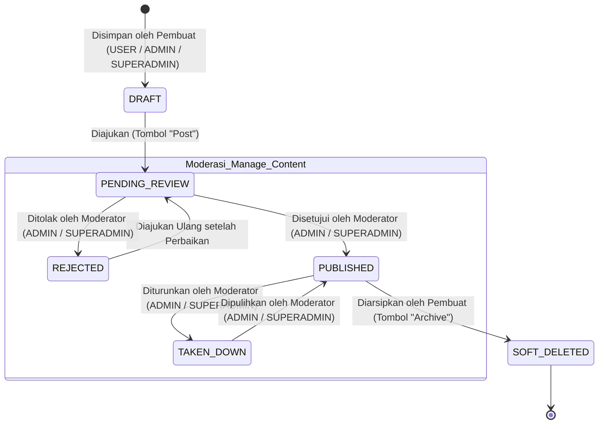

# Permission & Role-Based Access Control (RBAC) Module

Dokumen ini menjadi spesifikasi teknis dan aturan otorisasi berbasis peran (*Role-Based Access Control* / RBAC) lintas-modul pada aplikasi Benah Palembang. Dokumen ini mengatur hak akses setiap peran pengguna pada seluruh halaman dashboard, *child pages* (sub-routes), Data Access Layer (DAL), Server Actions, hingga adaptasi UI di sisi klien.

Aturan otentikasi dan lifecycle session merujuk pada [`docs/rules/auth-rules.md`](file:///Users/lanstheprodigy/Data/project/benah-palembang/docs/rules/auth-rules.md) dan arsitektur modular merujuk pada [`docs/rules/project-structure.md`](file:///Users/lanstheprodigy/Data/project/benah-palembang/docs/rules/project-structure.md).

---

## 1. Scope & Prinsip Otorisasi

Modul Permission menerapkan prinsip **Pertahanan Berlapis (*Defense-in-Depth*)** di mana keamanan diterapkan pada setiap lapisan aplikasi, bukan hanya dengan menyembunyikan navigasi di sisi klien:

1. **Role Canonical:** Menggunakan enum Prisma `UserRole` dengan tiga tingkat hak akses:
   - `SUPERADMIN`
   - `ADMIN`
   - `USER`
2. **Pemberlakuan Multi-Layer:** Otorisasi wajib diterapkan pada:
   - **Route & Page Boundary:** Server Components memverifikasi session dan role sebelum merender halaman atau *child page*.
   - **Data Access Layer (DAL):** Fungsi query server-only memeriksa role atau membatasi data berdasarkan `actor.id` sebelum mengeksekusi query database.
   - **Server Actions:** Setiap aksi mutasi memvalidasi session dan role di awal eksekusi.
   - **Client UI:** Komponen client (seperti Sidebar dan Action Bar) menyaring tampilan untuk kenyamanan pengguna (*UX layer*).
3. **Actor Identification Immutability:**
   - Identitas pengguna (`actor.id`) dan peran pengguna (`actor.role`) **selalu** diperoleh dari session server yang tervalidasi via `requireCurrentUser()` atau `requireRole()`.
   - Parameter client seperti `actorId`, `userId`, atau `role` dari request body, query params, atau hidden input tidak pernah dipercaya sebagai sumber otorisasi.
4. **Strict Ownership Scoping:**
   - Untuk data milik pribadi (Artikel, Event, Profil), akses edit, update, dan pratinjau author dibatasi secara ketat hanya untuk record di mana `authorId = actor.id` atau `ownerId = actor.id`.

---

## 2. Definisi & Karakteristik Peran

### 2.1. `SUPERADMIN` (Akses Penuh Tanpa Batasan)
Peran tertinggi dalam platform dengan kendali menyeluruh terhadap seluruh modul:
- Mengakses seluruh menu utama dan *child pages* di dashboard.
- Memiliki akses eksklusif ke **Manage Account** (melihat daftar, membuat akun user/admin, mengubah peran `USER <-> ADMIN`, melakukan ban/unban, dan soft delete akun).
- Memiliki akses eksklusif ke **Log Activities** (audit trail dan riwayat aktivitas sistem).
- Mengelola konfigurasi situs pada **Manage Website**.
- Melakukan moderasi konten pada **Manage Content** (*Approve*, *Reject*, *Takedown*, *Restore*).
- Membuat dan mengelola artikel serta agenda acara miliknya sendiri.
- Akun `SUPERADMIN` dilindungi secara khusus: tidak dapat di-ban, di-unban, diubah rolenya, atau di-soft-delete oleh aksi mana pun.

### 2.2. `ADMIN` (Manajemen Konten & Situs)
Peran pengelola operasional konten dan tampilan situs:
- Mengakses **Overview** (ringkasan platform dan metrik).
- Mengakses dan memperbarui **Manage Website** (Landing Page, Hero Kategori, Agenda, Kolaborasi, Header & Footer).
- Mengakses dan memoderasi konten pada **Manage Content** beserta halaman pratinjau moderasi (*Approve*, *Reject*, *Takedown*, *Restore*).
- Membuat dan mengelola artikel serta agenda acara miliknya sendiri (*Create Article* & *Create Event*).
- Mengelola profil personal miliknya sendiri.
- **Dilarang Mengakses:** Menu **Manage Account** (`/dashboard/account/*`) dan **Log Activities** (`/dashboard/logs`).

### 2.3. `USER` (Kreator Konten & Komunitas)
Peran pengguna reguler / kreator komunitas:
- Membuat, mengedit, melihat pratinjau, dan mengajukan artikel miliknya sendiri (*Create Article*).
- Membuat, mengedit, melihat pratinjau, dan mengajukan agenda acara miliknya sendiri (*Create Event*).
- Mengelola profil personal, foto avatar, banner sampul, dan informasi kontak miliknya sendiri (*Profile*).
- Menggunakan fitur interaksi publik yang memerlukan login (memberikan Like pada artikel/event dan mengirim/menghapus komentar pada artikel).
- **Dilarang Mengakses:** **Overview**, **Manage Website**, **Manage Account**, **Manage Content**, dan **Log Activities**.
- **Default Landing Page:** Ketika login atau membuka URL root dashboard (`/dashboard`), pengguna dengan peran `USER` secara otomatis dialihkan ke **`/dashboard/create-article`**.

---

## 3. Matriks Hak Akses Komprehensif

### 3.1. Matriks Route & Page (Termasuk Child Pages)

| No | Modul / Halaman | Path Route Canonical | `SUPERADMIN` | `ADMIN` | `USER` | Guard Server Component |
| :---: | :--- | :--- | :---: | :---: | :---: | :--- |
| **1** | **Dashboard Root / Overview** | `/dashboard` | ✅ Ya | ✅ Ya | ❌ *Redirect* | `requireRole(["ADMIN", "SUPERADMIN"])` |
| **2** | **Manage Website** | `/dashboard/website` | ✅ Ya | ✅ Ya | ❌ *Redirect* | `requireRole(["ADMIN", "SUPERADMIN"])` |
| **3** | **Manage Account (User)** | `/dashboard/account/user` | ✅ Ya | ❌ *Redirect* | ❌ *Redirect* | `requireRole(["SUPERADMIN"])` |
| **4** | **Manage Account (Admin)** | `/dashboard/account/admin` | ✅ Ya | ❌ *Redirect* | ❌ *Redirect* | `requireRole(["SUPERADMIN"])` |
| **5** | **Account Detail** | `/dashboard/account/[role]/[id]` | ✅ Ya | ❌ *Redirect* | ❌ *Redirect* | `requireRole(["SUPERADMIN"])` |
| **6** | **Manage Content** | `/dashboard/content` | ✅ Ya | ✅ Ya | ❌ *Redirect* | `requireRole(["ADMIN", "SUPERADMIN"])` |
| **7** | **Moderation Article Preview** | `/dashboard/content/[id]/article` | ✅ Ya | ✅ Ya | ❌ *Redirect* | `requireRole(["ADMIN", "SUPERADMIN"])` |
| **8** | **Moderation Event Preview** | `/dashboard/content/[id]/event` | ✅ Ya | ✅ Ya | ❌ *Redirect* | `requireRole(["ADMIN", "SUPERADMIN"])` |
| **9** | **Create Article (List)** | `/dashboard/create-article` | ✅ Ya | ✅ Ya | ✅ Ya | `requireCurrentUser()` |
| **10** | **Create Article (New Form)** | `/dashboard/create-article/new` | ✅ Ya | ✅ Ya | ✅ Ya | `requireCurrentUser()` |
| **11** | **Create Article (Edit Form)** | `/dashboard/create-article/edit?id=...` | ✅ Ya* | ✅ Ya* | ✅ Ya* | `requireCurrentUser()` + *Owner check* |
| **12** | **Create Article (Author Preview)** | `/dashboard/create-article/preview/[id]` | ✅ Ya* | ✅ Ya* | ✅ Ya* | `requireCurrentUser()` + *Owner check* |
| **13** | **Create Event (List)** | `/dashboard/create-event` | ✅ Ya | ✅ Ya | ✅ Ya | `requireCurrentUser()` |
| **14** | **Create Event (New Form)** | `/dashboard/create-event/new` | ✅ Ya | ✅ Ya | ✅ Ya | `requireCurrentUser()` |
| **15** | **Create Event (Edit Form)** | `/dashboard/create-event/edit?id=...` | ✅ Ya* | ✅ Ya* | ✅ Ya* | `requireCurrentUser()` + *Owner check* |
| **16** | **Create Event (Author Preview)** | `/dashboard/create-event/preview/[id]` | ✅ Ya* | ✅ Ya* | ✅ Ya* | `requireCurrentUser()` + *Owner check* |
| **17** | **Log Activities** | `/dashboard/logs` | ✅ Ya | ❌ *Redirect* | ❌ *Redirect* | `requireRole(["SUPERADMIN"])` |
| **18** | **Profile** | `/dashboard/profile` | ✅ Ya | ✅ Ya | ✅ Ya | `requireCurrentUser()` |

*\*Catatan Akses Bertanda Bintang (\*): Akses diberikan kepada seluruh peran yang login, namun dibatasi secara ketat hanya untuk konten yang dimiliki oleh pengguna tersebut (`authorId === actor.id` atau `ownerId === actor.id`). Percobaan mengakses ID milik pengguna lain akan menghasilkan `notFound()`.*

---

### 3.2. Matriks Data Access Layer (DAL) Queries

Fungsi query server-only yang bertugas mengambil data dari database PostgreSQL wajib memasang guard otorisasi sebelum query dijalankan:

| Modul Domain | Fungsi DAL Server-Only | Guard Otorisasi | Keterangan Scoping & Keamanan |
| :--- | :--- | :--- | :--- |
| **Website Content** | `getLandingPageEditor()` | `requireRole(["ADMIN", "SUPERADMIN"])` | Membaca draft dan konfigurasi editor Landing Page. |
| | `getArticleCategoryPageEditor()` | `requireRole(["ADMIN", "SUPERADMIN"])` | Membaca konfigurasi hero kategori artikel. |
| | `getAgendaPageEditor()` | `requireRole(["ADMIN", "SUPERADMIN"])` | Membaca konfigurasi hero halaman agenda. |
| | `getCollaborationPageEditor()` | `requireRole(["ADMIN", "SUPERADMIN"])` | Membaca konfigurasi halaman kolaborasi. |
| | `getHeaderFooterContentEditor()` | `requireRole(["ADMIN", "SUPERADMIN"])` | Membaca konfigurasi global header & footer. |
| **Account Manage** | `getManagedAccounts()` | `requireRole(["SUPERADMIN"])` | Mengambil daftar akun dengan pagination & filter role. |
| | `getManagedAccount()` | `requireRole(["SUPERADMIN"])` | Mengambil detail akun lengkap berdasarkan UUID. |
| **Manage Content** | `getManagedContent()` | `requireRole(["ADMIN", "SUPERADMIN"])` | Mengambil artikel & event berstatus non-draft untuk moderasi. |
| | `getManagedArticle(id)` | `requireRole(["ADMIN", "SUPERADMIN"])` | Mengambil detail artikel untuk pratinjau moderator. |
| | `getManagedEvent(id)` | `requireRole(["ADMIN", "SUPERADMIN"])` | Mengambil detail event untuk pratinjau moderator. |
| **Article (Owner)** | `getOwnedArticles()` | `requireCurrentUser()` | Query difilter ketat `where: { authorId: actor.id, deletedAt: null }`. |
| | `getArticleEditor(id)` | `requireCurrentUser()` | Mengambil artikel untuk diedit; wajib `authorId === actor.id`. |
| | `getOwnedArticle(id)` | `requireCurrentUser()` | Mengambil artikel untuk pratinjau author; wajib `authorId === actor.id`. |
| **Event (Owner)** | `getOwnedEvents()` | `requireCurrentUser()` | Query difilter ketat `where: { ownerId: actor.id, deletedAt: null }`. |
| | `getOwnedEvent(id)` | `requireCurrentUser()` | Mengambil event untuk diedit/pratinjau; wajib `ownerId === actor.id`. |
| **Profile** | `getCurrentProfile()` | `requireCurrentUser()` | Mengambil data profil actor aktif `where: { id: actor.id }`. |

---

### 3.3. Matriks Server Actions (Mutasi Data)

Semua Server Action dianggap sebagai public endpoint dan wajib memvalidasi otorisasi di baris pertama fungsi:

| Modul Domain | Server Action | Guard Role / Scope | Hasil Jika Tidak Diizinkan |
| :--- | :--- | :--- | :--- |
| **Website Content** | `updateLandingPageAction` | `requireRole(["ADMIN", "SUPERADMIN"])` | Error `{ success: false, message: "Akses ditolak." }` |
| | `updateArticleCategoryPagesAction` | `requireRole(["ADMIN", "SUPERADMIN"])` | Error `{ success: false, message: "Akses ditolak." }` |
| | `updateAgendaPageAction` | `requireRole(["ADMIN", "SUPERADMIN"])` | Error `{ success: false, message: "Akses ditolak." }` |
| | `updateCollaborationPageAction` | `requireRole(["ADMIN", "SUPERADMIN"])` | Error `{ success: false, message: "Akses ditolak." }` |
| | `updateHeaderFooterContentAction` | `requireRole(["ADMIN", "SUPERADMIN"])` | Error `{ success: false, message: "Akses ditolak." }` |
| **Account Manage** | `createAccountAction` | `requireRole(["SUPERADMIN"])` | Error `{ success: false, message: "Akses ditolak." }` |
| | `changeAccountRoleAction` | `requireRole(["SUPERADMIN"])` | Error `{ success: false, message: "Akses ditolak." }` |
| | `setAccountBanStatusAction` | `requireRole(["SUPERADMIN"])` | Error `{ success: false, message: "Akses ditolak." }` |
| | `softDeleteAccountAction` | `requireRole(["SUPERADMIN"])` | Error `{ success: false, message: "Akses ditolak." }` |
| **Manage Content** | `approveContentAction` | `requireRole(["ADMIN", "SUPERADMIN"])` | Error `{ success: false, message: "Akses ditolak." }` |
| | `rejectContentAction` | `requireRole(["ADMIN", "SUPERADMIN"])` | Error `{ success: false, message: "Akses ditolak." }` |
| | `takedownContentAction` | `requireRole(["ADMIN", "SUPERADMIN"])` | Error `{ success: false, message: "Akses ditolak." }` |
| | `restoreContentAction` | `requireRole(["ADMIN", "SUPERADMIN"])` | Error `{ success: false, message: "Akses ditolak." }` |
| **Article (Owner)** | `createArticleDraftAction` | `requireCurrentUser()` | Mengikat artikel baru ke `authorId = actor.id` |
| | `updateArticleAction` | `requireCurrentUser()` | Memvalidasi kepemilikan `authorId === actor.id` |
| | `submitArticleForReviewAction` | `requireCurrentUser()` | Memvalidasi kepemilikan `authorId === actor.id` |
| | `softDeleteArticleAction` | `requireCurrentUser()` | Memvalidasi kepemilikan `authorId === actor.id` |
| **Event (Owner)** | `saveEventAction` | `requireCurrentUser()` | Memvalidasi kepemilikan `ownerId === actor.id` |
| | `postEventAction` | `requireCurrentUser()` | Memvalidasi kepemilikan `ownerId === actor.id` |
| | `archiveEventAction` | `requireCurrentUser()` | Memvalidasi kepemilikan `ownerId === actor.id` |
| **Profile** | `updateProfileAction` | `requireCurrentUser()` | Hanya memutasi record `id = actor.id` |
| | `requestProfilePasswordResetAction`| `requireCurrentUser()` | Mengirim email reset ke `actor.email` terverifikasi |
| **Interaksi Publik** | `toggleArticleLikeAction` | `requireCurrentUser()` | Toggle like berbasis pasangan `(articleId, actor.id)` |
| | `toggleEventLikeAction` | `requireCurrentUser()` | Toggle like berbasis pasangan `(eventId, actor.id)` |
| | `createArticleCommentAction` | `requireCurrentUser()` | Menambahkan komentar terikat `userId = actor.id` |
| | `deleteArticleCommentAction` | `requireCurrentUser()` | Soft-delete komentar terikat `userId = actor.id` |

---

## 4. Strategi Pengalihan (*Redirect*) & Penanganan Akses Ditolak

Ketika pengguna mencoba mengakses halaman yang tidak sesuai dengan hak aksesnya, server guard di `src/modules/auth/data/session-dal.ts` menerapkan aturan pengalihan otomatis:

```text
                                  ┌─────────────────────────────┐
                                  │   Permintaan Masuk Route    │
                                  └──────────────┬──────────────┘
                                                 │
                                       Session Valid?
                                        /             \
                                    TIDAK              YA
                                      /                 \
            ┌───────────────────────────────┐      Role Sesuai?
            │ Redirect: /login              │       /        \
            │ ?reason=session-required      │    TIDAK        YA
            └───────────────────────────────┘     /            \
                                                 /          Render Halaman
                 ┌──────────────────────────────┴──────────────────────────────┐
                 │                                                             │
           Role = USER?                                                  Role = ADMIN?
           (Mencoba akses Overview, Website,                             (Mencoba akses Account,
            Account, Content, Logs)                                       Logs)
                 │                                                             │
                 ▼                                                             ▼
  ┌───────────────────────────────┐                             ┌───────────────────────────────┐
  │ Redirect:                     │                             │ Redirect:                     │
  │ /dashboard/create-article     │                             │ /dashboard                    │
  └───────────────────────────────┘                             └───────────────────────────────┘
```

### 4.1. Implementasi Helper Guard Canonical
Guard canonical pada `src/modules/auth/data/session-dal.ts` dikonfigurasi sebagai berikut:

```ts
export async function requireRole(roles: AuthRole[]) {
  const user = await getCurrentUser()
  if (!user) redirect("/login?reason=session-invalid")
  
  if (!roles.includes(user.role)) {
    // Pengalihan cerdas sesuai peran pengguna
    redirect(user.role === "USER" ? "/dashboard/create-article" : "/dashboard")
  }

  await scheduleActivityTouch(user.id)
  return user
}
```

---

## 5. Alur Kreasi & Moderasi Konten yang Seragam

Seluruh pembuatan konten (Artikel dan Event) memiliki alur siklus hidup (*lifecycle*) yang seragam tanpa memandang siapa pembuatnya:



### Aturan Alur Konten:
1. **Kreasi Mandiri:** Ketika `ADMIN` atau `SUPERADMIN` membuat artikel/event dari menu *Create Article* / *Create Event*, konten berstatus awal `DRAFT` dan diajukan menjadi `PENDING_REVIEW`.
2. **Pemisahan Peran Kreator vs Moderator:** Persetujuan penayangan publik dilakukan secara objektif melalui modul **Manage Content** (`/dashboard/content`).
3. **Audit Trail Moderasi:** Setiap perubahan status moderasi dicatat bersama identitas actor peninjau ke central activity log.

---

## 6. Integrasi Session Revocation & Keamanan Peran

Perubahan peran akun merupakan operasi keamanan tingkat tinggi (*security-critical*):

1. **Sinkronisasi Sesi Instan:**
   Ketika `SUPERADMIN` mengubah peran akun (`USER -> ADMIN` atau `ADMIN -> USER`), fungsi `changeAccountRoleAction` wajib memanggil dan meng-`await` helper pencabutan sesi:
   ```ts
   await prisma.user.update({
     where: { id: targetUserId },
     data: { role: newRole },
   })

   // Cabut seluruh sesi aktif target pengguna seketika
   await revokeUserSessions(targetUserId)
   ```
2. **Dampak pada Pengguna Target:**
   - Nilai `user-version` milik target di Upstash Redis dinaikkan secara atomic.
   - Sesi lama pengguna langsung tidak valid pada request berikutnya.
   - Pengguna target diarahkan untuk login kembali dan memperoleh snapshot token sesi baru dengan hak akses yang telah diperbarui.

---

## 7. Adaptasi UI Klien & Navigasi Sidebar

Komponen navigasi [`Sidebar.tsx`](file:///Users/lanstheprodigy/Data/project/benah-palembang/src/components/dashboard/Sidebar.tsx) menyaring menu secara dinamis menggunakan DTO aman dari hook `useCurrentUser()`:

```ts
const menuItems = [
  { title: "Overview", icon: LayoutDashboard, path: "/dashboard", roles: ["SUPERADMIN", "ADMIN"] },
  { title: "Manage Website", icon: Monitor, path: "/dashboard/website", roles: ["SUPERADMIN", "ADMIN"] },
  { 
    title: "Manage Account", icon: Users, path: "/dashboard/account", roles: ["SUPERADMIN"],
    subItems: [
      { title: "User", path: "/dashboard/account/user" },
      { title: "Admin", path: "/dashboard/account/admin" }
    ]
  },
  { title: "Manage Content", icon: FileText, path: "/dashboard/content", roles: ["SUPERADMIN", "ADMIN"] },
  { title: "Create Article", icon: PenTool, path: "/dashboard/create-article", roles: ["SUPERADMIN", "ADMIN", "USER"] },
  { title: "Create Event", icon: CalendarPlus, path: "/dashboard/create-event", roles: ["SUPERADMIN", "ADMIN", "USER"] },
  { title: "Log Activities", icon: Activity, path: "/dashboard/logs", roles: ["SUPERADMIN"] },
]

// Filter menu sesuai peran pengguna yang sedang aktif
const filteredMenu = menuItems.filter(item => item.roles.includes(user.role))
```

---

## 8. Checklist Validasi & Pengujian RBAC

Sebelum fitur otorisasi dianggap selesai, lakukan verifikasi skenario berikut:

### Skenario Pengujian `USER`:
- [ ] Login sebagai `USER` (`user@example.com`), diarahkan langsung ke `/dashboard/create-article`.
- [ ] Sidebar hanya menampilkan: **Create Article**, **Create Event**, dan **Profile**.
- [ ] Mencoba membuka `/dashboard` (Overview) $\rightarrow$ dialihkan (*redirect*) ke `/dashboard/create-article`.
- [ ] Mencoba membuka `/dashboard/website` $\rightarrow$ dialihkan ke `/dashboard/create-article`.
- [ ] Mencoba membuka `/dashboard/content` $\rightarrow$ dialihkan ke `/dashboard/create-article`.
- [ ] Mencoba membuka `/dashboard/account/user` $\rightarrow$ dialihkan ke `/dashboard/create-article`.
- [ ] Mencoba membuka `/dashboard/logs` $\rightarrow$ dialihkan ke `/dashboard/create-article`.
- [ ] Mencoba membuka artikel milik user lain di `/dashboard/create-article/edit?id=...` $\rightarrow$ menghasilkan `notFound()`.
- [ ] Membuka `/dashboard/create-article` dan `/dashboard/create-event` untuk mengelola konten milik sendiri $\rightarrow$ berhasil.

### Skenario Pengujian `ADMIN`:
- [ ] Login sebagai `ADMIN` (`admin@example.com`), diarahkan ke `/dashboard` (Overview).
- [ ] Sidebar menampilkan: **Overview**, **Manage Website**, **Manage Content**, **Create Article**, **Create Event**, dan **Profile**.
- [ ] Sidebar **tidak** menampilkan: **Manage Account** dan **Log Activities**.
- [ ] Mencoba membuka `/dashboard/account/user` atau `/dashboard/account/admin` $\rightarrow$ dialihkan ke `/dashboard`.
- [ ] Mencoba membuka `/dashboard/logs` $\rightarrow$ dialihkan ke `/dashboard`.
- [ ] Mengakses `/dashboard/content` dan membuka `/dashboard/content/[id]/article` atau `/dashboard/content/[id]/event` $\rightarrow$ tombol moderasi (*Approve*, *Reject*, *Takedown*, *Restore*) berfungsi sempurna.
- [ ] Mengakses `/dashboard/website` dan menyimpan perubahan konten situs $\rightarrow$ berhasil.

### Skenario Pengujian `SUPERADMIN`:
- [ ] Login sebagai `SUPERADMIN` (`super@example.com`), diarahkan ke `/dashboard` (Overview).
- [ ] Seluruh menu sidebar dan child pages dapat diakses tanpa hambatan.
- [ ] Mengakses `/dashboard/account/user` dan `/dashboard/account/admin` $\rightarrow$ dapat membuat akun, mengubah peran, ban/unban, dan soft delete.
- [ ] Mengakses `/dashboard/logs` $\rightarrow$ dapat melihat log audit sistem.

### Perintah Validasi Teknis:
```bash
# Validasi integritas schema database
npx prisma validate

# Validasi type safety TypeScript
npx tsc --noEmit

# Validasi standar linter
npm run lint

# Validasi build produksi Next.js
npm run build
```
